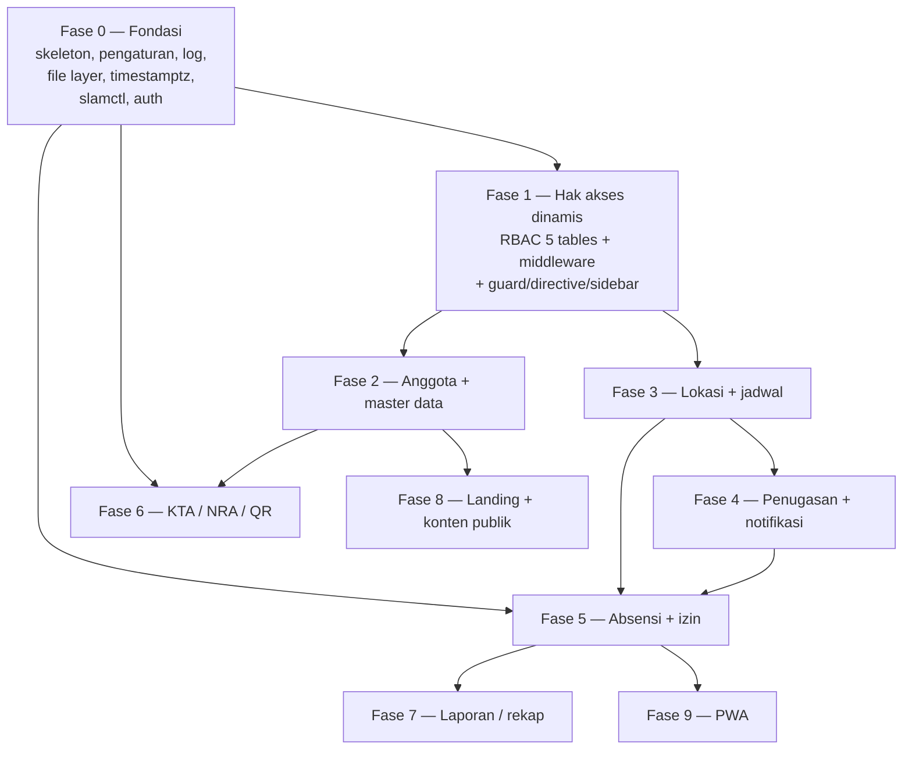

# SLAM Team — Master Task List (00-general-tasks)

> Scouting Legion Airsofter Malang — greenfield rebuild. Go (Gin + GORM) + PostgreSQL `slamteam_db`; Angular 21 PWA + Bootstrap 5 + ngx-translate; Node 24. Domain `slamteam.id`.
>
> **Single sources of truth:** schema/columns/relations → `slamteam_db.dbml`; requirements/rules → `workflow/.rancangan.txt`; conventions → `slam-team-api/CLAUDE.md`, `slam-team-app/CLAUDE.md`, `ARCHITECTURE.md`.
> **Rule:** if prose and `.dbml` disagree, the `.dbml` wins. Routes/payloads/column names follow rancangan Bab 9 + `.dbml`, never the old app (visual reference only).

This document is the top-level index. Each work item has its own detailed file under `workflow/modules/` (planning) and `workflow/prompts/` (executor prompt). See section 5 for the ordered list of those files.

---

## 1. Modules + cross-cutting foundations

### 1.1 The 19 modules (from rancangan Bab 2 — `kode` seeds `mst_modul` and prefixes permission codes, e.g. `anggota.create`)

| # | Kode | Nama modul | Kelompok |
|---|------|------------|----------|
| 1 | `anggota` | Master Data Anggota | Master Data |
| 2 | `admin` | Master Data Admin | Master Data |
| 3 | `moderator` | Master Data Moderator | Master Data |
| 4 | `user` | Master Data User | Master Data |
| 5 | `instansi` | Master Data Instansi / Sekolah | Master Data |
| 6 | `unit` | Master Data Unit | Master Data |
| 7 | `prestasi` | Master Data Prestasi | Master Data |
| 8 | `inorga` | Master Data Inorga | Master Data |
| 9 | `kegiatan` | Master Data Kegiatan | Konten |
| 10 | `artikel` | Master Data Artikel | Konten |
| 11 | `medsos` | Master Data Medsos | Konten |
| 12 | `profile_club` | Master Data Profile Club | Konten |
| 13 | `dokumen` | Master Data Dokumen | Sistem |
| 14 | `hak_akses` | Pengaturan Hak Akses & Peran | Sistem |
| 15 | `lokasi` | Master Data Lokasi | Operasional |
| 16 | `jadwal` | Modul Jadwal | Operasional |
| 17 | `absensi` | Modul Absensi | Operasional |
| 18 | `izin` | Pengajuan Izin & Pulang Cepat | Operasional |
| 19 | `kta` | Kartu Tanda Anggota | Operasional |

> `admin` / `moderator` / `user` are user-management surfaces over `users` + `user_role` filtered by role — not separate tables.

### 1.2 Cross-cutting Fase 0 foundations (built once, before any module)

These are NOT modules but prerequisites every module depends on. Built and finished in Fase 0.

| Foundation | What it delivers |
|------------|------------------|
| Project skeleton | Go (Gin/GORM/zap, JWT HS256, `internal/modules/core/<mod>` pattern) + Angular 21 (standalone, signals, zoneless) scaffolds wired end-to-end. |
| `mst_pengaturan` | Typed key-value settings (grup, is_terkunci, is_publik) — 20 seed rows (Bab 8.5). Drives file variants, KTA dims, absensi thresholds, NRA. |
| `log_aktivitas` | Audit log (old/new value, actor, IP) — used by RBAC changes and all mutations. |
| File layer (3 variants) | `mst_file` + `mst_file_varian`; original/medium/low sized from `mst_pengaturan`; async variant generation; auto-orient EXIF; sha256; type-from-content. Private files served ONLY via authenticated `GET /files/{uuid}/{varian}`. Passes the Bab 6.6 upload checklist. |
| timestamptz conventions | All time columns `timestamptz` UTC + IANA timezone column; Go imports `_ "time/tzdata"`; display in schedule tz. |
| `slamctl create-superadmin` | CLI-only first super admin; refuses if a super admin exists; NOT an HTTP endpoint. |
| Auth + `sesi_login` | login (username OR email) + refresh + logout; `/me`, `/me/permissions`; replaces the placeholder toy `users` table with the real schema (`anggota_id`, `username`, `email`, `role_id`, ...). |

---

## 2. Phases (Fase 0..9 — rancangan Bab 12.1)

Ordering is by technical dependency: absensi needs files + jadwal; jadwal needs hak akses; everything needs the time/file/settings foundation.

| Fase | Nama | Prasyarat | Isi |
|------|------|-----------|-----|
| **0** | Fondasi | — | Go + Angular skeleton, `mst_pengaturan`, `log_aktivitas`, 3-variant file management + upload checklist (Bab 6.6), timestamptz conventions, `slamctl create-superadmin`, auth (login/refresh/logout, `sesi_login`). |
| **1** | Hak akses dinamis | 0 | 5 RBAC tables (`mst_modul`, `mst_permission`, `mst_role`, `role_permission`, `user_role`), seed matrix (Bab 3.5), Go `RequirePermission` middleware (per-request cache `perm:role:{id}`, `perm_version`), Angular `canActivate` guard + `*hasPermission` directive + dynamic sidebar, Hak Akses admin page. |
| **2** | Anggota + master data | 1 | `anggota`, `instansi`, `unit`, `prestasi`, `inorga`, `medsos`, `dokumen`, `profile_club`, user-management (admin/moderator/user surfaces) — repeating-pattern CRUD. |
| **3** | Lokasi + jadwal | 1 | `mst_lokasi` (map picker), `jadwal` CRUD, `jadwal_sesi` generator (recurrence: harian/mingguan/bulanan/kustom), calendar view. |
| **4** | Penugasan jadwal | 3 | `jadwal_peserta` single + bulk (by instansi / by jenis-status / open self-enroll), `wajib_absen`, accept/reject flow, in-app notifikasi. |
| **5** | Absensi | 0, 3, 4 | Absen screen (camera + GPS, secure context), backend validation (Haversine, server-time window, status assignment), izin, moderator override, session-closer job (marks `alfa` only for `wajib_absen=true`). |
| **6** | KTA / NRA / QR | 0, 2 | `mst_wilayah` seed, NRA Postgres SEQUENCE + manual-edit setval guard, `kta`, PNG generate (ID-1/CR80 + bleed), bulk print (`batch_cetak_id`), public QR page, reprint/revoke. |
| **7** | Laporan / rekap | 5 | `absensi_rekap` per anggota/jadwal/periode, Excel + PDF export, attendance dashboard. |
| **8** | Landing + konten publik | 2 | `kegiatan`, `artikel`, public profil/artikel/kegiatan/prestasi pages. |
| **9** | PWA + penyempurnaan | 5 | manifest, service worker, icons, iOS Safari redirect for camera, schedule reminders. |

> Fase 6 depends only on Fase 0 + 2 — it does NOT wait for jadwal/absensi. With more than one developer, the KTA track can run parallel to Fase 3–5.

---

## 3. Dependency graph



ASCII fallback:

```
Fase 0 ──┬── Fase 1 ──┬── Fase 2 ──┬── Fase 6 (also needs Fase 0)
         │            │            └── Fase 8
         │            └── Fase 3 ──── Fase 4 ──┐
         ├────────────────────────────────────┼── Fase 5 ──┬── Fase 7
         │  (Fase 5 needs Fase 0 + 3 + 4)      │            └── Fase 9
         └── Fase 6 (needs Fase 0 + 2) ────────┘

Parallel track: 0 → 2 → 6 (KTA) can run alongside 3 → 4 → 5.
```

---

## 4. Progress table (seeded all-X per rancangan Bab 12.2)

Legend: **V** selesai · **P** sedang dikerjakan · **X** belum dikerjakan. **Model** = tier to build the module with (see [`EXECUTION.md`](./EXECUTION.md); Opus 4.8 for hard/domain-heavy, Sonnet 5 for CRUD; ★ = run at `xhigh` effort). Paste each prompt as-is — no preamble.

| Modul | Fase | Model | C | R | U | D | Status | Catatan |
|-------|------|-------|---|---|---|---|--------|---------|
| Fondasi & manajemen berkas | 0 | Opus | X | X | X | X | X | Prasyarat seluruh modul |
| Hak akses | 1 | Opus ★ | X | X | X | X | X | RBAC dinamis, bypass super admin |
| Anggota | 2 | Sonnet | X | X | X | X | X | |
| Instansi / Sekolah | 2 | Sonnet | X | X | X | X | X | |
| Unit | 2 | Sonnet | X | X | X | X | X | |
| Prestasi | 2 | Sonnet | X | X | X | X | X | |
| Inorga | 2 | Sonnet | X | X | X | X | X | |
| Medsos | 2 | Sonnet | X | X | X | X | X | |
| Dokumen | 2 | Sonnet | X | X | X | X | X | |
| Profile Club | 2 | Sonnet | X | X | X | X | X | |
| User management (admin/moderator/user) | 2 | Opus | X | X | X | X | X | Surface atas `users` + `user_role` |
| Lokasi | 3 | Sonnet | X | X | X | X | X | Map picker |
| Jadwal | 3 | Opus ★ | X | X | X | X | X | Generator sesi (recurrence) |
| Penugasan jadwal | 4 | Opus | X | X | X | X | X | Single + bulk, `wajib_absen` |
| Absensi | 5 | Opus ★ | X | X | X | X | X | Kamera + GPS, server-time authority |
| Izin | 5 | Opus | X | X | X | X | X | approve / tolak, pulang cepat |
| KTA & QR | 6 | Opus ★ | X | X | X | X | X | NRA sequence, public token page |
| Laporan | 7 | Opus | X | X | X | X | X | Rekap + export Excel/PDF |
| Kegiatan | 8 | Sonnet | X | X | X | X | X | |
| Artikel | 8 | Sonnet | X | X | X | X | X | |
| Landing page | 8 | Sonnet | X | X | X | X | X | Public content |
| PWA | 9 | Sonnet | X | X | X | X | X | Manifest, SW, iOS redirect |

---

## 5. Work-item files

Each id below has a planning file `workflow/modules/<id>.md` and an executor prompt `workflow/prompts/<id>.md`. Ordered by build sequence (foundations first, then per phase).

| Id | Work item | Fase | Notes |
|----|-----------|------|-------|
| `01-foundation` | Project skeleton, timestamptz conventions, slamctl | 0 | Go + Angular wiring, `_ "time/tzdata"`, CLI super-admin. |
| `02-file-management` | 3-variant file layer + upload checklist | 0 | `mst_file` / `mst_file_varian`; Bab 6.6 checklist; private `GET /files/{uuid}/{varian}`. |
| `03-pengaturan-log` | `mst_pengaturan` + `log_aktivitas` | 0 | 20 seed rows; `is_terkunci` / `is_publik`; `GET /public/pengaturan`. |
| `04-auth-session` | Auth + `sesi_login` | 0 | login (username OR email)/refresh/logout, `/me`, `/me/permissions`; replaces toy users table. |
| `05-hak-akses` | Dynamic RBAC | 1 | 5 tables, seed matrix, middleware, guard/directive/sidebar, admin page. |
| `06-anggota` | Anggota master data | 2 | Foto formal, jenis_anggota, status_anggota, no_induk. |
| `07-user-management` | admin/moderator/user surfaces | 2 | Over `users` + `user_role` filtered by role; anti-escalation. |
| `08-instansi` | Instansi / Sekolah | 2 | Used by bulk assignment + `instansi_sendiri` cakupan. |
| `09-unit` | Unit | 2 | |
| `10-prestasi` | Prestasi | 2 | Public-readable. |
| `11-inorga` | Inorga | 2 | |
| `12-medsos` | Medsos | 2 | |
| `13-dokumen` | Dokumen | 2 | Private files. |
| `14-profile-club` | Profile Club | 2 | Feeds landing page. |
| `15-lokasi` | Lokasi + map picker | 3 | `mst_lokasi`, radius_meter default. |
| `16-jadwal` | Jadwal + sesi generator | 3 | Recurrence, timezone, `generate-sesi`, calendar. |
| `17-penugasan-notifikasi` | Penugasan + in-app notifikasi | 4 | single/bulk, `wajib_absen`, accept/reject, notifikasi. |
| `18-absensi` | Absensi | 5 | Camera + GPS, Haversine, server-time, statuses, override, session-closer. |
| `19-izin` | Izin & pulang cepat | 5 | `absensi_izin`; approve/tolak. |
| `20-kta-nra-qr` | KTA / NRA / QR | 6 | `mst_wilayah`, NRA sequence, PNG gen, bulk print, public page, reprint/revoke. |
| `21-laporan-rekap` | Laporan / rekap | 7 | `absensi_rekap`, Excel/PDF export, dashboard. |
| `22-kegiatan` | Kegiatan | 8 | Public + admin. |
| `23-artikel` | Artikel | 8 | Public + admin. |
| `24-landing-publik` | Landing + public content | 8 | profil/artikel/kegiatan/prestasi public pages. |
| `25-pwa` | PWA + penyempurnaan | 9 | manifest, SW, icons, iOS Safari redirect, reminders. |

> Note for every APP prompt: use the **design-taste-frontend** skill (announce "Using design-taste-frontend"), run its pre-flight/audit, map to Bootstrap 5, and enforce the SLAM design tokens in `workflow/_shared/design-tokens.md`. `blog-fe` is currently empty — if its source is restored, mirror its layout for the screen; otherwise follow the design tokens.

---

## 6. The 3 hardest screens to design FIRST (rancangan Bab 11.3)

These have no equivalent in the old app and resemble no CRUD page, so they must be designed up front rather than left to end-stage generation:

1. **RBAC grid** — role × modul permission matrix with the C/R/U/D + cakupan (semua / instansi_sendiri / milik_sendiri) dimension. (Fase 1 / `05-hak-akses`)
2. **Schedule calendar** — jadwal + generated `jadwal_sesi`, recurrence, timezone-aware display (07:00 WIB, not browser tz). (Fase 3 / `16-jadwal`)
3. **Attendance / absen screen** — front camera selfie + GPS, secure-context handling, out-of-radius confirmation, permission-denied guidance. (Fase 5 / `18-absensi`)
